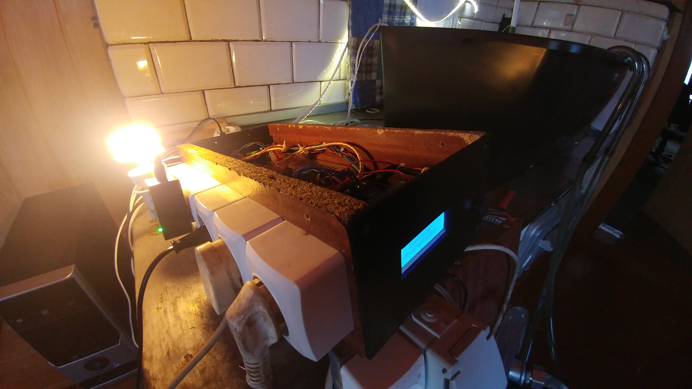
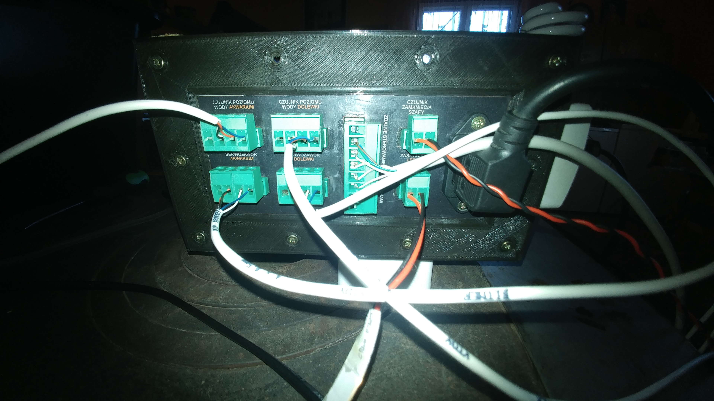
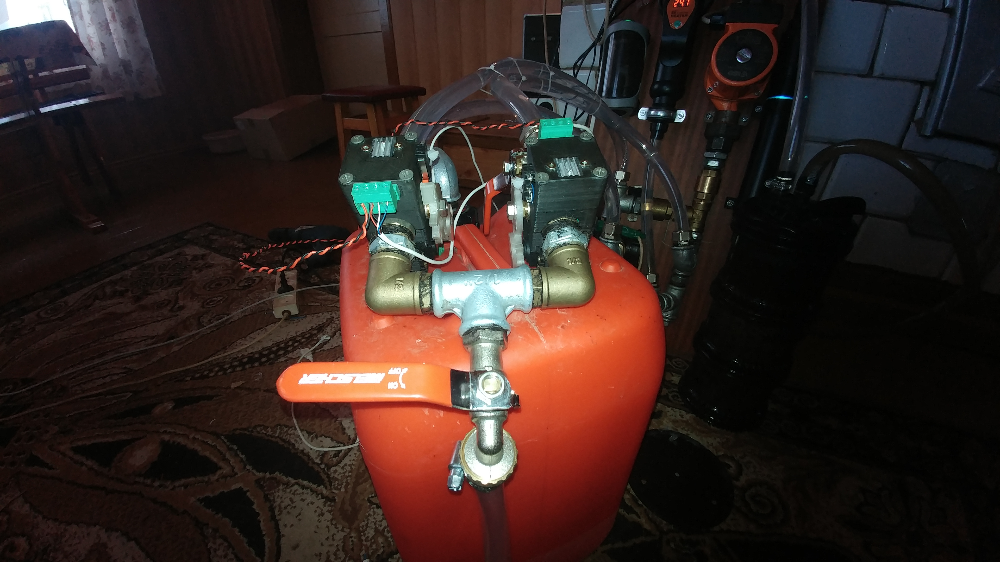
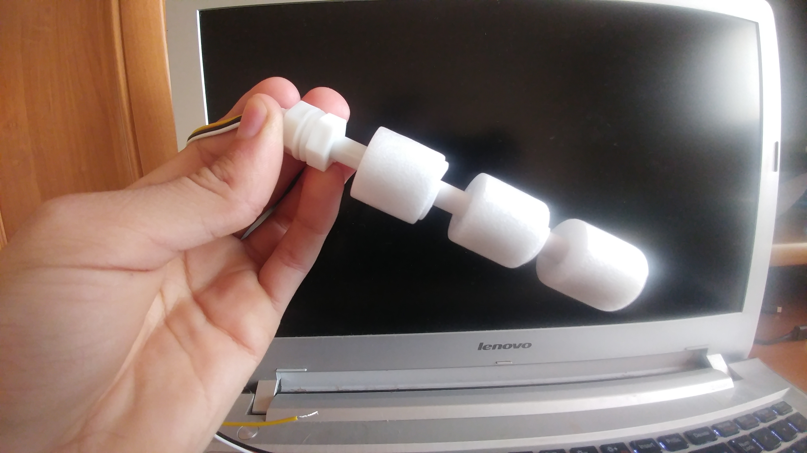

# Simple aquaristic controller

### Language: **English** / [Polski](docs/pl/README.md)

## This project is a simple prototype of Aquaristic controller that supports automatic water change and automatic water addition from addional water tank.

## Main goals of this project:
- automatic water change basing on data coming from sensors
- half-automatic water change "add/remove"
- automatic water addition
- automatic water addition tank refill
- feeding mode
- operating accessories in the aquarium

## What will you need?
- basic knowledge about electrics and electronics
- soldering station
- knowledge about making a wires
- working 3D printer

# Gallery
## Front:

## Side:

## Back:

## Inside:

# Hydraulics and pumps

## Requied hardware
- Arduino Due board
- `LCD 2004` screen with `HD44780` I2C converter
- `DS1302` RTC clock
- analog joystick like `KY-023`
- SSR relay module
- automatic water addition pump (from washer for example)
- four servovalves with close detection

# Servovalves

## Why not solenoid valves?
Solenoid valves require pressure to operate.
When removing water from the aquarium using mainly gravity
we do not have enough pressure, so the use of solenoid valves falls off.
In addition, we use one hose here to inflow and outflow water from the aquarium.

## My own servovalves design
I have created my own servovalve design cheaper than servovalves from store.
3D printing knowledge is required to build them.
If you want to use another servovalves project you need to make
a fork of this project and implement your own interface
from `include/control/valves/valveModule.hpp`.

### Read more about servovalves [here](docs/en/servovalves.md).

# Water level sensors

## What can you use?
You can use what sensor you want. The only one
requirement is to conduct mass to arduino pin when
sensor detect water.

I know from experience that loose copper bare wires
as the electrodes of the water level sensor is not an ideal idea.
Unless the water level sensor is galvanically separated from
power sources just like industrial versions do.

## What am I using?
I use float sensors in my design,
because they are simple, cheap and effective.

### Read more about water level sensors [here](docs/en/water-level-sensors.md).

# The relays

## Why not mechanical relays?
Mechanical relays failed in my case.
In yours probably will not work too, and that's all
due to electromagnetic interferences that occurs
when switching. Partly it is the fault of the coils themselves,
partly it's the fault of the mechanical relays
do not switch at zero.

And Arduino is in no way protected against interference.

## Why SSR relays?
SSR relays have such an advantage over mechanical relays,
that they do not create electromagnetic interference. They are also more durable.
They have more energy losses, but for me it doesn't make much difference.

## Whose SSR relays?
It all depends on how power-hungry devices you connect.
The heater will probably be the most resource-consuming device.
I used an 8 channel SSR relay with `G3MB-202P OMRON` modules.
However, the maximum load capacity of these relays is only two amps.
So I had to buy a separate SSR relay `FOTEK SSR-40 DA 40A DC-AC`,
because my heater was too big for small OMRONs.

You may also need one more relay.

Remember that SSR modules intended for AC will not be
operate on DC current! Switching at zero blocks
the whole relay, since the DC current is direct current and there is no zero,
until you turn off the power.

So depending on the project you may need
a separate relay for LED strips.

### Read more about relays [here](docs/en/relays.md).

# How system works?
The system consists of 11 non-blocking
modules. Each module manages only its own part of the system.
For example: the `aerationControl` module only deals with
aeration management and the `lightControl` module takes care of
only aquarium lighting.

Each module has its own dependencies injected by the constructor.

And why manual injection? Because I did not think that C++ might have
working dependency injection system and I do not like to create
global variables.

### Read more about system [here](docs/en/system.md).

# Configuration
Configuration files are located here:
- screen: `include/control/screen/lcd.hpp`
- RTC clock: `include/control/rtc/configuration.hpp`
- relays: `include/control/relayModule/devices.hpp`
- water level sensors: `include/control/waterLevelSensor/devices.hpp`
- servovalves: `include/control/valves/devices.hpp`
- system modules: `include/modules/Modules.hpp`

# Installation
To upload this project you need the latest PlatformIO IDE.
Then connect the Arduino with a USB cable to the computer
and upload the project to the controller.

# First run
After the first start you need to check whether
everything has been connected properly.

## RTC clock
First make sure the RTC clock is
connected correctly. To do this, go to
`Main menu -> Settings -> Time and day cycle -> Current time`
and set the current time. Then disconnect the controller
completely from power and after a short while connect it on again.
If time has been preserved, we know
that the RTC clock has been connected correctly.

## Service mode
Then make sure to connect
sensors, devices and servo valves.
To activate the service mode, enter
`Main menu -> Settings -> Service mode`.
Then our eyes will see three main categories.
- `Sensors`: this category is for checking
correctness of connecting water level sensors.
- `Devices`: this category is used testing
the correctness of connecting relays, wiring and
the order of connecting the devices themselves.
- `Valves`: possibility to test servo valves.
We have five options here:
    - `Aquarium`: servo valve connected
    to main water circulation and filtering system in the aquarium
    - `Refill`: refill tank servo valve
    - `Clean water`: servo valve connected to the source of
    clean water from a tap or water pipe
    - `Sewage water`: servo valve for water outlet from aquarium
    - `Remote valves`: shows whether remote connection
    with servo valves is connected.

