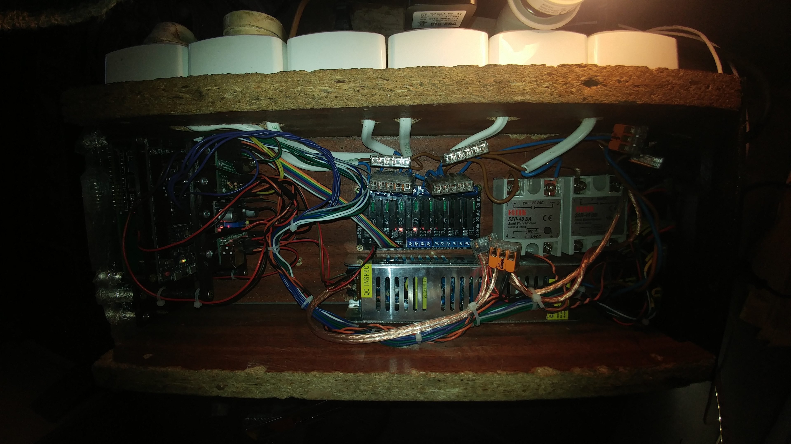
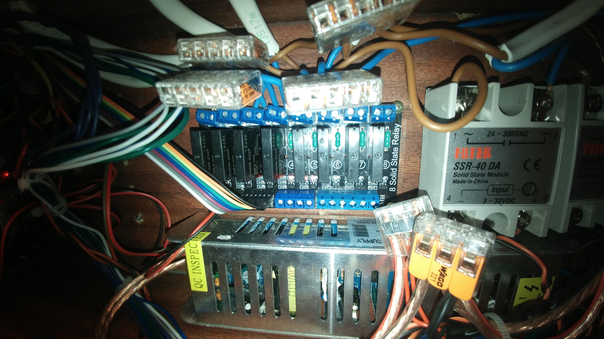

# Relays

Solid state relays are very important
part of this project. You have to choose those that
will suit our needs.

The most important is to know what current
our devices will draw and selection of right SSR modules.

In my case, almost all devices
could be served by relays
`G3MB-202P OMRON` whose maximum
the load is 2A which gives the maximum value
460W for one device. However, it is not worth approaching
to this value, so I suggest you hook up to
these relays up to 300W.

The above pictures are showing two additional
SSR relays made by `Fotek`.

The first one of them is used for connecting a 500W heater.

The second one is SSR DC-DC type. It can switch
direct current. I use it to turn on the LED lighting,
because my Arduino is powered
from the same power supply as the LED lighting.

In addition, I gave the distance between the bottom of the `Fotek`
relays and the bottom of the controller to maintain better cooling.

**Remember that SSR modules intended for AC will not be
operate on DC current! Switching at zero blocks
the whole relay, since there is no zero crossing,
until you turn off the power.**