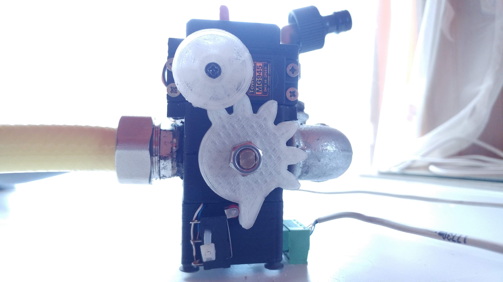

# DIY servo valves

## What do you need to assemble servo valves?
- four servos in standard size, e.g. `TowerPro MG945`
- four ball valves
- four voltage regulators 5V or 6V,
- four heat sinks for voltage regulators
- four endstops
- four mounting strips 4-pin 5.08mm female + superglue for gluing them to 3D printed case
- four mounting strips 4-pin 5.08mm male
- some cables
- some filament for a 3D printer other than PLA

## How strong must the servos used in the project be?
My servos `TowerPro MG945` have a capacity of 10 kg per cm with 5V supply.
According to my observations, they are barely enough
for 1/2 inch ball valves. It's best to use a servo
with a higher load than those described above.
You should also remember about strong enough
voltage stabilizer and an appropriate heat sink.
My servo housing with PLA at the stabilizer heat sink
becomes soft after frequent switching
servo valves in a short period of time,
so I advise you to watch this too.

## STL files
STL files can be found in the folder
`assets/stl/servovalve`.

## Plug
1. Red: from + 6V to + 32V connected to a 5V voltage stabilizer, servo connected to a 5V voltage stabilizer output
2. Black: common ground for servo valve power supply and aquarium controller power supply
3. White: PWM control signal connected directly to the servo
4. Blue: endstop detecting servo valve closing, if enabled - conducts common ground, **not +5V or +12V!**

# API
The main interface of the servo valve driver is in the file
`include/control/valves/ValveModule.hpp`.

We have two instances of servo valve driver available:
1. `ValveModuleUsingInternalPwm` - this driver uses
    Arduino as a device generating PWM signal.
    The PWM outputs for this instance are configured in
    using pinout in the section `Valves servos pwm pinout definition`.
    The rest of the pinout is shared with the second driver.
2. `ValveModuleUsingExternalDriver` - this driver
    can be used in case of problems with the PWM generated
    by Arduino Due. I had to use it.
    This driver uses `Adafruit PWM Servo Driver`
    or any clone supported by the library
    `Adafruit PWM Servo Driver library`.
    Additional when using this module you don't need
    to worry about the configuration section
    `Valves servos pwm pinout definition`,
    it is not used when configuring this driver.

## The main API consists of five methods:
- `bool open(unsigned short valveId);`
- `bool close(unsigned short valveId);`
- `bool set(unsigned short valveId, bool state);`
- `bool isClosed(unsigned short valveId);`
- `bool areRemotesAvailable();`

Three blocking methods called `open`,` close` and `set`
are used to open and close servo valves.
As you can see, they return a boolean variable.
This is the result of executing the command.
If these methods return `true`, then
the controller knows that the servo valve did
command correctly. Otherwise, when `false` is returned,
the controller closes all servo valves and will show
information that there is a problem with servo valves
and you have to look at them and fix them.

The `isClosed` method, as the name suggests, returns
information about current status of the servo valve.
It reads this information from the endstop of
selected servo valve. If the endstop is closed
returns `true`, otherwise `false`.

The `areRemotesAvailable` method is a special method,
which should also be implemented
if the aquarium is not permanently attached to
source of clean water and sewage. It detects
if the remote servo valve control cable in another
room is connected to servo valves.
It can be e.g. a LAN cable in which one wire
is mass, next to are used for servo control
using the PWM signal, the next two are door detection
servo valves and the last one is detection
if remotes steering cable is connected.
It is shorted simply with mass.

The current API works in such a way that the servo valve has 2-3 seconds to open
or close, if it does not do it in this time - an error is reported.

The main definition is in `include/control/valves/ValveModule.hpp`.
Individual implementations are in the same folder.

## ValveModuleBase
It's a class you can inherit. This is the base for the servo valve driver
with special functionality - disconnects the PWM signal of the servos after a specified time.
If we use ordinary servos in our servo valves, we can simply implement just
two protected methods and do not worry about automatic servo valves detach.

### Why disconnect the servo valve control signal?
Built in drivers in servos can cause servo buzzing
hich means that the servo is trying to move to
selected position, even if it is missing just 0.1 degree,
so it doesn't use all the power of the servo and uses the engine
all the time but can't move to the end. It puts a load to the stabilizers,
so that they may not provide the required current to the servo at the required time,
which will cause a problem moving it to the selected position.

### Implementation:
To implement your own driver inheriting from `ValveModuleBase` you should
overwrite two protected, abstract methods:
- `void moveServo (unsigned short valveId, bool state);`
- `void detach (unsigned short valveId);`

The `moveServo` method is used to handle the movement of the servo - opening it or
closing depending on the value of the `bool state` argument.
It should not block the program execution.

The `detach` method is used to interrupt the PWM control signal feed
for servo. It is called after a set time. `ValveModuleBase` automatically
memorizes the last time the servo was moved and calls this method after timeout.

