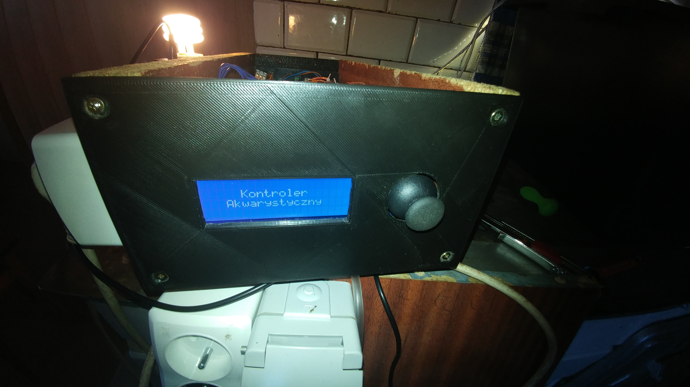
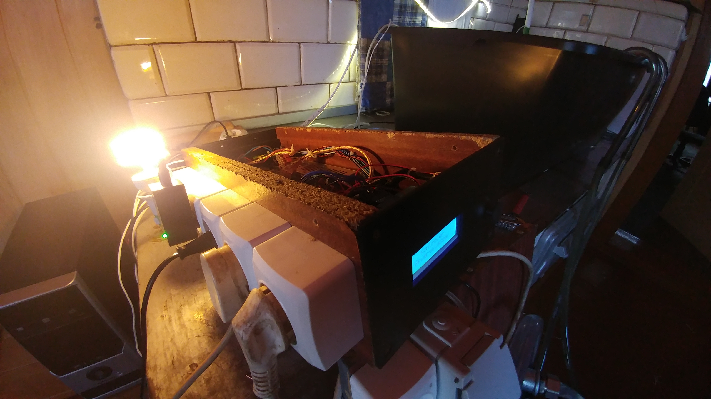
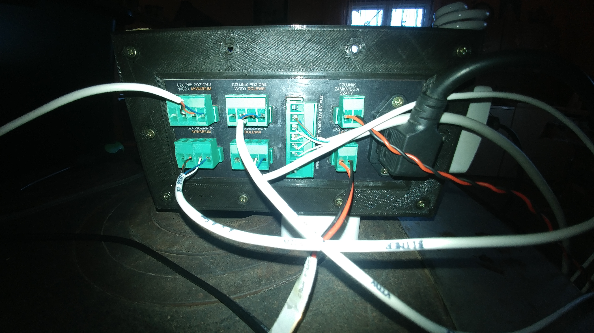
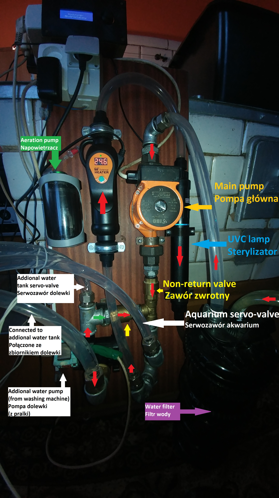
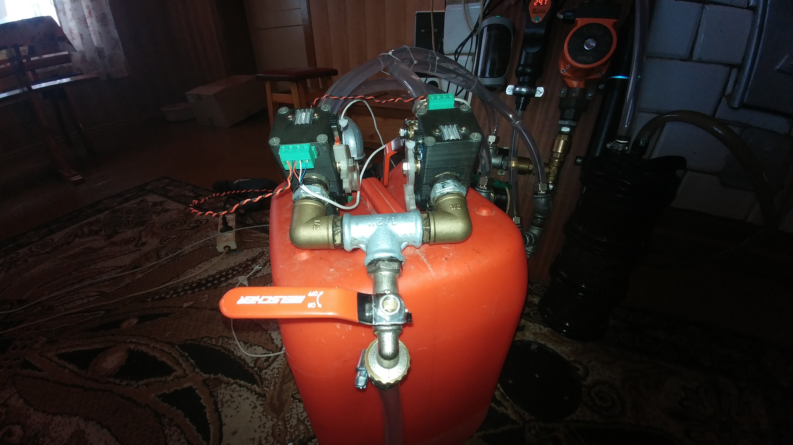
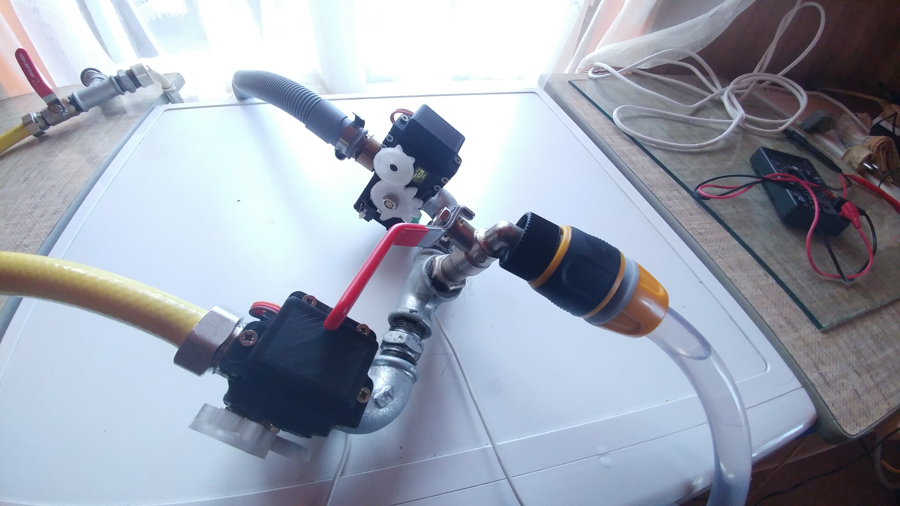
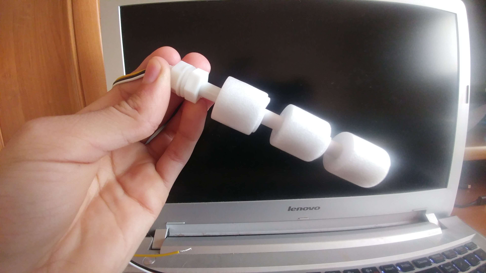

# Prosty kontroler akwarystyczny

## Ten projekt jest prostym kontrolerem akwarystycznym z obsługą automatycznej podmiany wody i dolewki ze zbiornika rezerwowego.

## Główne cele tego projektu:
- automatyczna podmiana wody bazująca na czujnikach
- półautomatyczna podmiana wody "dolej/wylej"
- automatyczna dolewka wody ze zbiornika rezerwowego
- automatyczne uzupełnianie zbiornika dolewki
- tryb karmienia
- obsługa osprzętu w akwarium

PLAN:
- postawić kamerę na wprost ekranu i joysticka
- odpalić automatyczną podmianę wody
- zrobić timelapsa ze wszystkich kroków
- w trakcie timelapsa pokazywać jak włączają się i wyłączają serwozawory
- do tego dodać timelapsa z napełniania "akwarium"

## Czego potrzebujesz przede wszystkim?
- podstawowa wiedza na temat elektryki
- stacja lutownicza i wiedza jak jej użyć
- umiejętność zarabiania kabli
- sprawna drukarka 3D

# Kontroler
## Przód:

## Bok:

## Tył:

## Środek:

# Hydraulika i pompy

## tutaj idzie wejście w bańce w sensie tuba zasysająca

# Potrzebny sprzęt:
- płytka Arduino Due
- wyświetlacz `LCD 2004` z konwerterem I2C `HD44780`
- zegar RTC `DS1302`
- analogowy joystick współpracujący z Arduino, np. `KY-023`
- zewnętrzny zegar RTC z własną baterią wspierany przez bibliotekę `RTC@2.3.3`
- płytka przekaźników SSR
- dwa zawory zwrotne w układzie akwarium
- pompa automatycznej dolewki (np. nowa do pralki)
- cztery serwozawory z detekcją domyku

# Serwozawory

## Czemu nie elektrozawory?
Elektrozawory wymagają ciśnienia do działania.
Podczas usuwania wody z akwarium za pomocą w głównej mierze grawitacji
nie mamy wystrczającego ciśnienia, więc użycie elektrozaworów odpada.
Poza tym, używamy tu jednego przewodu do wpływu i wypływu wody z akwarium.

## Własny projekt serwozaworów
Stworzyłem własny projekt serwozaworów tańszy niż serwozawory ze sklepów.
Całkowity koszt to jakieś 60 złotych za sztukę.
Do ich złożenia wymagana jest umiejętność użycia drukarki 3D.
Jeśli chcesz skorzystać z gotowych serwozawórów ze sklepu możesz zrobić forka
projektu i podmienić klasę w pliku `include/control/valves/ValveModule.hpp`
na własną implemetację sterownika serwozawórów.

### Więcej na temat serwozaworów przeczytasz [tutaj](serwozawory.md).

# Czujniki poziomu wody

## Czego możesz użyć?
Możesz użyć czego chcesz. Wystarczy że gdy czujnik wykrywa wodę
poda na wybrany pin masę. Jeśli na pinie nie ma masy to znaczy
że czujnik nie wykrywa wody. Proste.

Z doświadczenia wiem, że zanużanie gołych miedzianych przewodów
jako elektrod czujnika poziomu wody nie jest idealnym pomysłem.
Chyba że czujnik poziomu wody jest separowany galwanicznie od
źródła zasilania, tak, jak robią to przemysłowe wersje.

## Czego ja używam?
Ja w swoim projekcie używam czujników pływakowych,
poniważ są proste, tanie, oraz skuteczne.

### Więcej na temat czujników poziomu wody przeczytasz [tutaj](czujniki-poziomu-wody.md).

# Przekaźniki

## Dlaczego nie przekaźniki mechaniczne?
Przekaźniki mechaniczne nie dały rady w moim wypadku.
W Twoim prawdopodobnie też nie dadzą rady, a to wszystko ze
względu na zakłócenia elektromagnetyczne pojawiające się
podczas przełączania. Częściowo jest to wina samych cewek,
częściowo jest to wina tego, że przekaźniki mechaniczne
nie przełączają w zerze.

A Arduino w żaden sposób nie jest zabezpieczone przed zakłóceniami.

## Dlaczego przekaźniki SSR?
Przekaźniki SSR mają taką przewagę nad przekaźnikami mechanicznymi,
że nie tworzą zakłóceń elektromagnetycznych. Są też trwalsze.
Mają za to większe straty, ale jak dla mnie nie robi to wielkiej różnicy.

## Jakie przekaźniki SSR?
Wszystko zależy od tego jak prądożerne urządzenia będziesz podłączać.
Najbardziej zasobożernym urządzeniem będzie prawdopodobnie grzałka.
Ja użyłem 8 kanałowego przekaźnika SSR z modułami `G3MB-202P OMRON`.
Jednakże, maksymalna obciążalność tych przekaźników to tylko dwa ampery.
Musiałem dokupić oddzielny przekaźnik SSR `FOTEK SSR-40 DA 40A DC-AC`,
ponieważ moja grzałka była zbyt mocna dla małych OMRON'ów.

Możliwe że będziesz potrzebować jeszcze jednego przekaźnika.
Pamiętaj, że moduły SSR przeznaczone do AC nie będą
działać na prądzie DC! Przełączanie w zerze blokuje
cały przekaźnik, jako że prąd DC to prąd stały i nie ma zera,
dopóki nie odłączysz zasilania.

Więc w zależności od projektu, możesz potrzebować
oddzielnego przekaźnika dla taśm LED.

### Więcej na temat przekaźników przeczytasz [tutaj](przekazniki.md).

# Jak działa system?
System składa się z 11 nie blokujących głównego wątku
modułów. Każdy moduł zarządza tylko swoją częścią systemu.
Dla przykładu: moduł `aerationControl` zajmuje się tylko
zarządzaniem napowietrzaniem a moduł `lightControl` zajmuje
się tylko oświetleniem akwarium.

Każdy moduł ma własne zależności wstrzyknięte przez konstruktor.

A czemu ręczne wstrzykiwanie? Bo nie pomyślałem, że C++ może mieć
działający system wstrzykiwania zależności a nie lubię tworzyć
zmiennych globalnych.
 
### Więcej na temat systemu przeczytasz [tutaj](system.md).

# Konfiguracja
Pliki konfiguracyjne:
- wyświetlacz: `include/control/screen/lcd.hpp`
- zegar RTC: `include/control/rtc/configuration.hpp`
- przekaźniki: `include/control/relayModule/devices.hpp`
- czujniki poziomu wody: `include/control/waterLevelSensor/devices.hpp`
- serwozawory: `include/control/valves/devices.hpp`
- moduły systemowe: `include/modules/Modules.hpp`

# Instalacja
Aby zainstalować projekt potrzebne jest najnowsze PlatformIO IDE.
Potem podłączasz Arduino za pomocą kabla usb do komputera
i uploadujesz projekt na kontroler.

# Pierwsze uruchomienie
Po pierwszym uruchomieniu trzeba sprawdzić czy
wszystko zostało podłączone właściwie.

## Zegar RTC
Najpierw należy upewnić się że zegar RTC został
podłączony poprawnie. W tym celu należy się udać do
`Menu główne -> Ustawienia -> Czas i cykl dnia -> Aktualna godzina`
i ustawić aktualny czas. Następnie trzeba odłączyć kontroler
całkowicie od zasilania i włączyć ponownie.
Jeśli czas został zachowany to wiemy,
że zegar RTC został podłączony poprawnie.

## Tryb serwisowy
Następnie należy upewnić się co do podłączenia
sensorów, urządzeń i serwozaworów.
Aby aktywować tryb serwisowy, trzeba wejść w
`Menu główne -> Ustawienia -> Tryb serwisowy`.
Wtedy naszym oczom ukażą się trzy główne kategorie.
- `Sensory`: ta kategoria służy do sprawdzenia
poprawności podłączenia czujników poziomu wody.
- `Urządzenia`: ta kategoria służy przetestowaniu
poprawności podłączenia przekaźników, okablowania i
kolejności podłączenia samych urządzeń.
- `Zawory`: możliwość przetestowania serwozaworów.
Mamy tutaj cztery opcje:
    - `Akwarium`: serwozawór podłączony
    pod obieg wody w akwarium
    - `Dolewka`: serwozawór zbiornika dolewki
    - `Czysta woda`: serwozawór zapięty do źródła
    czystej wody, z kranu lub wodociągu
    - `Brudna woda`: serwozawór do wody ściekowej
    - `Zdalne zawory`: pokazuje czy zdalne połączenie
    z serwozaworami jest podpięte.

