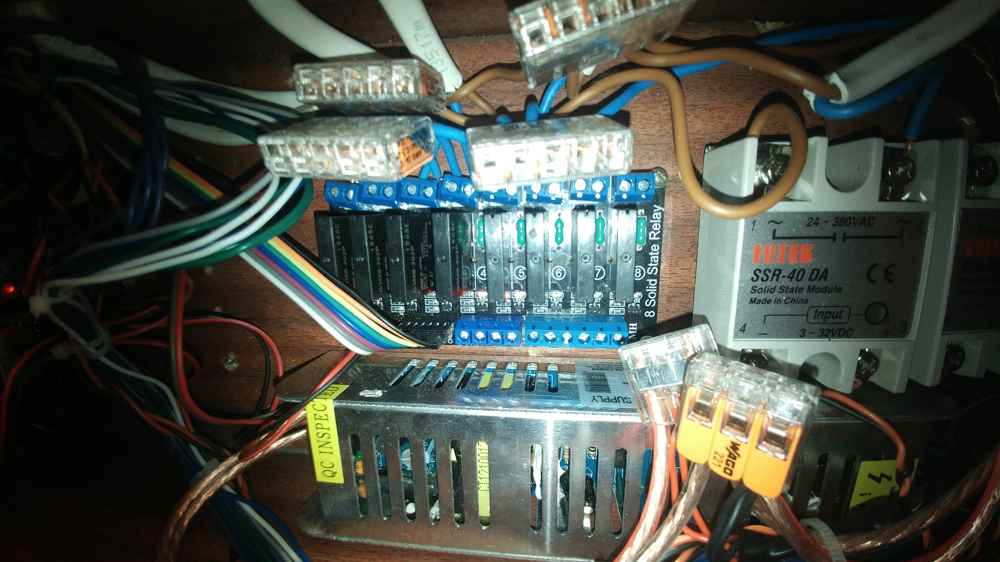
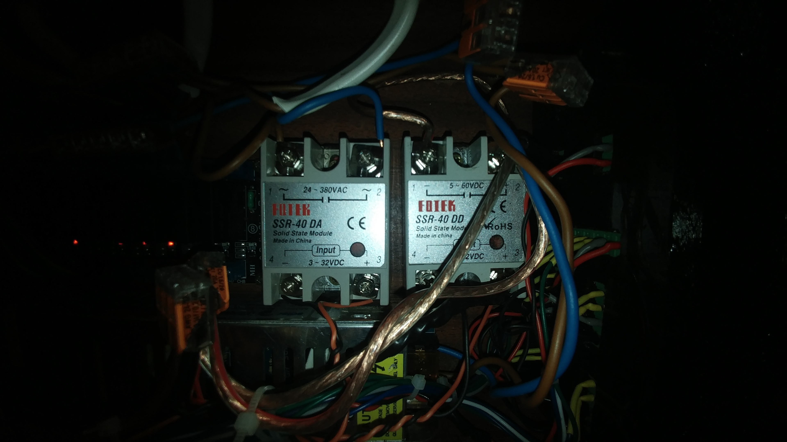

# Przekaźniki

Przekaźniki półprzewodnikowe SSR są bardzo ważną
częścią tego projektu. Trzeba dobrać takie, które
będą odpowiadały naszym potrzebom.

Najważniejsza jest wiedza jaki prąd będą pobierać
nasze urządzenia i dobranie modułów SSR
z odpowiednim zapasem, gdyż chcemy, żeby nasze
urządzenie było chłodzone pasywnie, bez żadnych
wentylatorów.

W moim wypadku prawie wszystkie urządzenia
mogły być obsłużone przez przekaźniki
`G3MB-202P OMRON` których maksymalne
obciążenie wynosi 2A co daje maksymalną wartość
460W na jedno urządzenie. Jednak nie warto zbliżać
się do tej wartości, więc sugeruję podpinać pod
te przekaźniki maksymalnie 300W.

Na powyższych zdjęciach widać również dwa dodatkowe
przekaźniki SSR od `Fotek`.

Pierwszy z nich służy mi do podłączenia grzałki 500W.

Drugi to SSR typu DC-DC. Może on przełączać
prąd stały. Używam go do załączania oświetlenia
ledowego, ponieważ moje Arduino jest zasilane
z tego samego zasilacza co oświetlenie ledowe.

Dodatkowo dałem dystanse między spodem przekaźników
`Fotek` a dnem kontrolera, żeby zachować lepsze chłodzenie.

**Pamiętaj, że moduły SSR przeznaczone do AC nie będą
działać na prądzie DC! Przełączanie w zerze blokuje
cały przekaźnik, jako że prąd DC to prąd stały i nie ma zera,
dopóki nie odłączysz zasilania.**